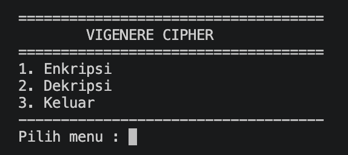
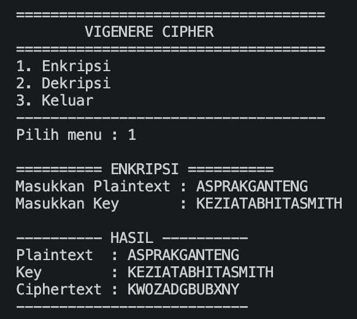
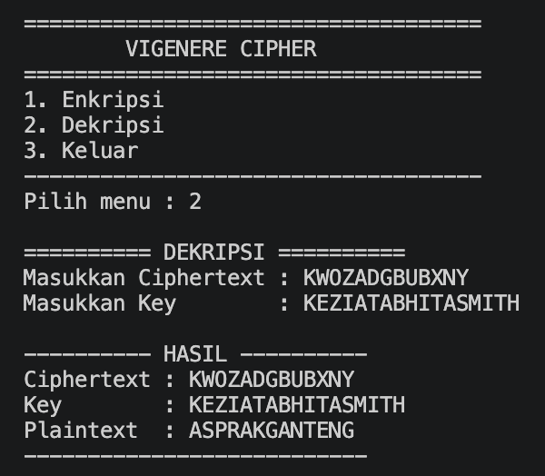

1. **Nama    : Kezia Tabhita Smith**
2. **NPM     : 140810240020**
3. **Kelas   : Kriptografi A**
4. **Tanggal : 22 September 2026**

# Vigenere-Cipher

Program C++ sederhana untuk melakukan **enkripsi** dan **dekripsi** menggunakan algoritma **Vigenere-Cipher** 

## Struktur Folder

```
Vigenere-Cipher/
├── vigenerecipher.cpp
└── README.md
```

## Fitur
1. **Enkripsi** — mengubah plaintext menjadi ciphertext menggunakan key berupa alfabet a-z yang diberikan.
2. **Dekripsi** — mengembalikan ciphertext menjadi plaintext menggunakan key berupa alfabet a-z yang diberikan.

## Alur Program
### 1. Program Dimulai

Ketika program dijalankan, pengguna akan diberikan menu utama:
```
=== VIGENERE CIPHER ===
1. Enkripsi
2. Dekripsi
3. Keluar
```

### 2. Enkripsi

Pada menu Enkripsi, pengguna memasukkan **Plaintext** dan **Key**

```
Contoh:
Plaintext : ASPRAKGANTENG
Key       : KEZIATABHITASMITH
```

Program kemudian melakukan proses enkripsi menggunakan rumus Vigenère Cipher:

```
C = (P + K) mod 26

Keterangan:

C = ciphertext

P = plaintext

K = key
```

Setiap karakter plaintext dipasangkan dengan karakter key. Jika panjang key lebih pendek daripada plaintext, key akan diulang secara otomatis.

```
Contoh:
Plaintext : A S P R A K G A N T E N
Key       : K E Z I A T A B H I T A
```

**Hasil enkripsi**
```
Ciphertext : KJOIADGBUBXN
```

### 3. Dekripsi

Pada menu Dekripsi, pengguna memasukkan **Ciphertext** dan **Key**

```
Contoh:
Ciphertext : KJOIADGBUBXN
Key        : KEZIATABHITASMITH
```
Program menggunakan rumus:

```
P = (C - K + 26) mod 26
```

Proses tersebut akan mengembalikan ciphertext menjadi plaintext semula.

**Hasil dekripsi**
```
Plaintext : ASPRAKGANTENG
```

Dengan demikian, hasil dekripsi menggunakan key yang benar akan menghasilkan kembali plaintext awal.

## Screenshot Program
1. Menu Utama
   


3. Enkripsi
   


5. Dekripsi
   

